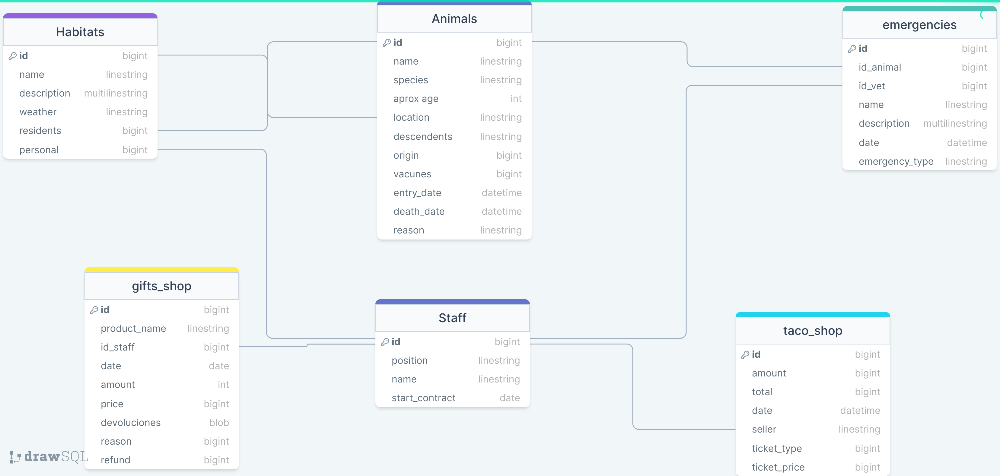

# MongoDB Zoo

Este proyecto tiene como objetivo desarrollar un sistema de administración de un zoologico usando temas tales como:

1. Consultas MongoDb Avanzadas
2. Autenticacion/Autorizacion con JWT 
3. Validacion de colecciones
4. Validacion con DTO
5. Endpoints como servicios

## Diagrama MER



## Funcionalidades principales

El sistema de administración de las bodegas cuenta con 

Claro, puedo ayudarte a complementar cada punto con las operaciones básicas de gestión. Aquí tienes una descripción de cada uno:

**1. Gestión de Animales:**
   - **Añadir Animales:** Permite registrar nuevos animales en el sistema, incluyendo detalles como especie, nombre, fecha de nacimiento, etc.
   - **Obtener Animales:** Permite consultar y visualizar la información de los animales existentes en la base de datos.
   - **Eliminar Animales:** Permite eliminar registros de animales que ya no están en el zoológico o que han sido transferidos a otro lugar.
   - **Actualizar Animales:** Permite modificar la información de un animal, por ejemplo, para actualizar su estado de salud o su ubicación en el zoológico.

**2. Gestión de Habitats:**
   - **Añadir Habitats:** Permite registrar nuevos hábitats donde los animales residirán, incluyendo detalles como el tipo de hábitat, tamaño, y ubicación.
   - **Obtener Habitats:** Permite consultar y visualizar la información de los hábitats existentes en el zoológico.
   - **Eliminar Habitats:** Permite eliminar registros de hábitats que ya no se utilizan o que han sido renovados.
   - **Actualizar Habitats:** Permite modificar la información de un hábitat, como su tamaño o estado de conservación.

**3. Gestión de Servicios:**
   - **Añadir Servicios:** Permite registrar los servicios disponibles para los visitantes del zoológico, como restaurantes, tiendas de regalos, o recorridos guiados.
   - **Obtener Servicios:** Permite consultar y visualizar la información de los servicios disponibles.
   - **Eliminar Servicios:** Permite eliminar servicios que ya no se ofrecen o que han cambiado.
   - **Actualizar Servicios:** Permite modificar la información de un servicio, por ejemplo, su horario de funcionamiento o tarifas.

**4. Gestión de staff (Empleados):**
   - **Añadir Empleados:** Permite registrar nuevos empleados del zoológico, incluyendo información como nombre, cargo, fecha de contratación, etc.
   - **Obtener Empleados:** Permite consultar y visualizar la información de los empleados activos en el zoológico.
   - **Eliminar Empleados:** Permite dar de baja a empleados que ya no trabajan en el zoológico.
   - **Actualizar Empleados:** Permite modificar la información de un empleado, como su salario o cargo.

**5. Gestión de Emergencias:**
   - **Registrar Emergencias:** Permite documentar situaciones de emergencia como incendios, escapes de animales peligrosos, o accidentes graves.
   - **Obtener Información de Emergencias:** Permite acceder a detalles sobre las emergencias pasadas, incluyendo cómo se manejaron y qué medidas se tomaron.
   - **Eliminar Registros de Emergencias:** Permite archivar registros de emergencias que ya se han resuelto y no son relevantes.
   - **Actualizar Información de Emergencias:** Permite agregar información adicional o actualizar el estado de una emergencia en curso.

**6. Gestión de Taquillería:**
   - **Venta de Boletos:** Permite registrar la venta de boletos de entrada al zoológico.
   - **Obtener Información de Ventas:** Permite consultar y visualizar datos sobre las ventas de boletos, como ingresos generados y asistencia.
   - **Eliminar Ventas:** Permite anular ventas en caso de errores o devoluciones.

Estas operaciones de gestión te ayudarán a administrar de manera efectiva un zoológico, asegurando un seguimiento adecuado de los animales, hábitats, servicios, personal y situaciones de emergencia, así como la gestión de la taquillería para los visitantes.


     
## Tecnologías utilizadas

El proyecto  utilizará las siguientes tecnologías:

- Lenguaje de programación: [JavaScript](https://developer.mozilla.org/es/docs/Web/JavaScript)
- Framework Backend: [Node.js](https://nodejs.org/)
- Base de datos: [MongoDB](https://www.mongodb.com/es)
- Framework: [Express.js](https://expressjs.com/)


## Configuración

### Instalación

#### Instalacion y uso de nvm
1. Para usar este proyecto despues de descargarlo asegurate de estar usando la version 18.16.1 de nvm, para eso vas a mandar el siguiente comando en la terminal.
    ```shell
    nvm install 18.16.1
    ```

2. Ahora vas a poner la version en uso con el siguiente comando.
    ```shell
    nvm use 18.16.1
    ```

3. Clona este repositorio en tu máquina local:

   ```shell
   git clone https://github.com/AngelVelasco1/Mongodb_Zoo
   ```

  * *Abre el repositorio en tu editor de código*

4. Navega hasta el directorio del proyecto:

   ```shell
   cd backend
   ```
5. Instala las dependencias del proyecto:

   ```shell
   npm i
   ```

6. Crea las colecciones Mongo usando la extension MongoDB for VSCO
    - En este caso de que desee manejar la base de datos de manera local.
    Dirijase a la ruta ./backend/db/zoo.mongodb, ahí encontrará el archivo llamado zoo.mongodb.
    Para ejecutar este archivo instale la extensión de visual studio code "MongoDB". Una vez instalada la extensión tiene que realizar todo el proceso de creación y conexión con una cuenta MongoAtlas. Luego debes ejecutar el archivo en la ruta ./backend/db/data.mongodb. Para más información referente a este tema recomendamos leer la documentación oficial

Para la facilidad del evaluador las variables de entorno se dejaron especificadas en el archivo .env.example tal y como están en el .env. Por lo que en caso de querer utilizar el proyecto de forma correcta, unicamente es renombrar el archivo

Cuando ya tenga la base de datos localmente se dirigirá nuevamente a la terminal que había abierto anteriormente y levantará el servidor de manera local usando el siguiente comando:
```shell
    npm run dev
   ```

### ENV
Antes de ejecutar la aplicación, asegúrate de crear y configurar el archivo de entorno (`.env`) con la siguiente estructura y reemplazar los valores por los adecuados:
```plaintext 
1. Configuración general server
SERVER = {"hostname": "localhost", "port": 8090}

2. Conexión a la base de datos
ATLAS_USER = "pruebas"
ATLAS_PASSWORD = "miguel"
ATLAS_DB = "zoo_db"

3.Clave privada 
JWT_SECRET = "campus"
```
### Versiones
El proyecto contiene 4 versiones
- 2.0.1 es referente al area comercial
    - Tiene acceso a taco_shop y Servicios con todos sus metodos POST, GET, PUT, DELETE
- 2.0.2 es referente al area de animales
    - Tiene acceso a habitat, animals Y emergencias con todos sus metodos POST, GET, PUT, DELETE
    - Tiene acceso a animales. Con metodos GET y PUT 

- 2.0.3 es referente al area de talento humano
    - Tiene acceso a staff. Con metodos POST, GET Y PUT.
- 1.0.0 es referente al Admin
    - Tiene acceso a todas las areas y versiones con todos los metodos GET, POST, DELETE, PUT

> ⚠️ **Importante:**
> Esas versiones son añadidas en los headers como tipo Accept-Version con valor de la version que usaralas (2.0.1, 2.0.2, 2.0.3,  1.0.0  )

## Endpoints Principales

## Gen Token
- Método: **POST**
- URL: `http://localhost:8090/login`
- Example json rol admin
```json
  {
    "name": "Pedro",
    "password": "admin"
  }
```
- Example json rol area de animales

```json
  {
      "name": "Farid",
      "password": "animales"
  }
```

> ⚠️ **Importante:**
> Una vez generado el token, copia y peguelo en un header de tipo authorization con un prefijo ``Bearer``


## CRUD 

###  `obtener Habitats`


- Método: **GET**
- URL: `http://localhost:8090/api/use/habitats?id=2`
- ROLES PERMITIDOS: admin, gerente area animal

> ⚠️ **Importante:**
> Este endpoint usa como parametro el id del habitat,Debes especificarlo con la sintaxis ?=id.

###  `crear Habitats`

- Método: **POST**
- URL: `http://localhost:8090/api/use/habitats`
- ROLES PERMITIDOS: admin
-  Cuerpo de la solicitud
  ```json
   {
        "name": "MultiCultural",
        "description": "Very diferent habitat",
        "weather": "Sunny",
        "residents": ["Lion", "Zebra", "Monkey"],
        "personnel": 4,
        "upcomingMaintenance":"2023-09-15"
    }
  ```


###  `actualizar Habitats`
- Método: **PUT**
- URL: `http://localhost:8090/api/use/habitats?id=2`
- ROLES PERMITIDOS: admin, gerente area animal
-  Cuerpo de la solicitud
  ```json
   {
        "name": "SingleCultural",
        "description": "Normal habitat",
        "weather": "Cloudy",
        "residents": ["Lion", "Zebra", "Leopard"],
        "personnel": 4,
        "upcomingMaintenance":"2023-09-16"
    }
  ```

> ⚠️ **Importante:**
> Este endpoint usa como parametro el id del habitat, Debes especificarlo con la sintaxis ?=id
###  `eliminar Habitats`

- Método: **DELETE**
- URL: `http://localhost:8090/api/use/habitats?id=2`
- ROLES PERMITIDOS: admin


###  `obtener animals`


- Método: **GET**
- URL: `http://localhost:8090/api/use/animals?id=2`
- ROLES PERMITIDOS: admin, gerente area animal

> ⚠️ **Importante:**
> Este endpoint usa como parametro el id del animal,Debes especificarlo con la sintaxis ?=id.

###  `crear animals`

- Método: **POST**
- URL: `http://localhost:8090/api/use/animals`
- ROLES PERMITIDOS: admin, gerente area animal
-  Cuerpo de la solicitud
  ```json
   {
       "staffId": 3, 
        "name": "Simba",
        "species": "Lion",
        "aprox_age": 8,
        "location": "Savannah",
        "descendents": ["Cub 1", "Cub 2"],
        "origin": "Captive breeding program",
        "vacunes": 1,
        "entryDate":"2021-03-10",
        "reason": "Captive bred" 
   }
  ```


###  `actualizar animals`
- Método: **PUT**
- URL: `http://localhost:8090/api/use/animals?id=2`
- ROLES PERMITIDOS: admin, gerente area animal
-  Cuerpo de la solicitud
  ```json
   {
         "staffId": 3, 
        "name": "Simba",
        "species": "Lion",
        "aprox_age": 8,
        "location": "Savannah",
        "descendents": ["Cub 1", "Cub 2"],
        "origin": "Captive breeding program",
        "vacunes": 1,
        "entryDate":"2021-03-10",
        "reason": "Captive bred" 
    }
  ```

> ⚠️ **Importante:**
> Este endpoint usa como parametro el id del animal, Debes especificarlo con la sintaxis ?=id
###  `eliminar animals`

- Método: **DELETE**
- URL: `http://localhost:8090/api/use/animals?id=2`
- ROLES PERMITIDOS: admin


###  `obtener emergencies`


- Método: **GET**
- URL: `http://localhost:8090/api/use/emergencies?id=2`
- ROLES PERMITIDOS: admin, gerente area animal

> ⚠️ **Importante:**
> Este endpoint usa como parametro el id del emergencia,Debes especificarlo con la sintaxis ?=id.

###  `crear emergencies`

- Método: **POST**
- URL: `http://localhost:8090/api/use/emergencies`
- ROLES PERMITIDOS: admin, gerente area animal
-  Cuerpo de la solicitud
  ```json
   {
          "animalId": 8,
      "vetId": 4,
      "description": "Severe injury on front paw",
      "date": "2023-08-05",
      "emergencyType": "Medical"
       
    }
  ```


###  `actualizar emergencies`
- Método: **PUT**
- URL: `http://localhost:8090/api/use/emergencies?id=2`
- ROLES PERMITIDOS: admin, gerente area animal
-  Cuerpo de la solicitud
  ```json
   {
           "animalId": 8,
      "vetId": 4,
      "description": "Severe injury on front paw",
      "date":"2023-08-05",
      "emergencyType": "Medical"
    }
  ```

> ⚠️ **Importante:**
> Este endpoint usa como parametro el id del emergencia, Debes especificarlo con la sintaxis ?=id
###  `eliminar emergencies`

- Método: **DELETE**
- URL: `http://localhost:8090/api/use/emergencies?id=2`
- ROLES PERMITIDOS: admin, gerente de animales


###  `obtener services`


- Método: **GET**
- URL: `http://localhost:8090/api/use/services?id=2`
- ROLES PERMITIDOS: admin, gerente comercial

> ⚠️ **Importante:**
> Este endpoint usa como parametro el id del servicio,Debes especificarlo con la sintaxis ?=id.

###  `crear services`

- Método: **POST**
- URL: `http://localhost:8090/api/use/services`
- ROLES PERMITIDOS: admin, gerente comercial
-  Cuerpo de la solicitud
  ```json
   {
      "name": "Gift Shop",
        "productName": "Plush Toy",
        "staffId": 8,
        "date": "2023-08-01",
        "quantity": 30,
        "price": 10,
        "devolutions": 2,
        "reason": "Defective stitching",
        "refund": 20
    }
  ```


###  `actualizar services`
- Método: **PUT**
- URL: `http://localhost:8090/api/use/services?id=2`
- ROLES PERMITIDOS: admin, gerente comercial
-  Cuerpo de la solicitud
  ```json
   {
      "name": "Gift Shop",
        "productName": "Plush Toy",
        "staffId": 8,
        "date": "2023-08-01",
        "quantity": 30,
        "price": 10,
        "devolutions": 2,
        "reason": "Defective stitching",
        "refund": 20
    }
  ```

> ⚠️ **Importante:**
> Este endpoint usa como parametro el id del servicio, Debes especificarlo con la sintaxis ?=id
###  `eliminar services`

- Método: **DELETE**
- URL: `http://localhost:8090/api/use/services?id=2`
- ROLES PERMITIDOS: admin, gerente comercial


###  `obtener staffs`


- Método: **GET**
- URL: `http://localhost:8090/api/use/staffs?id=2`
- ROLES PERMITIDOS: admin, gerente talento humano

> ⚠️ **Importante:**
> Este endpoint usa como parametro el id del staff,Debes especificarlo con la sintaxis ?=id.

###  `crear staffs`

- Método: **POST**
- URL: `http://localhost:8090/api/use/staffs`
- ROLES PERMITIDOS: admin, gerente talento humano
-  Cuerpo de la solicitud
  ```json
   {
       "name": "Emily Johnson",
        "startContract": "2022-01-15",
        "endContract": "2023-03-29",
        "salary": 45000,
        "eps": "HealthCare Inc.",
        "phoneNumber": 1234567890,
        "emergency_contact": {
          "contactName": "Michael Johnson",
          "relationship": "Spouse",
          "contactNumber": 9876543210
        }
    }
  ```


###  `actualizar staffs`
- Método: **PUT**
- URL: `http://localhost:8090/api/use/staffs?id=2`
- ROLES PERMITIDOS: admin, gerente talento humano
-  Cuerpo de la solicitud
  ```json
   {
      
       "name": "Emily Johnson",
        "startContract": "2022-01-15",
        "endContract": "2023-03-29",
        "salary": 45000,
        "eps": "HealthCare Inc.",
        "phoneNumber": 1234567890,
        "emergency_contact": {
          "contactName": "Michael Johnson",
          "relationship": "Spouse",
          "contactNumber": 9876543210
        }
    
    }
  ```

> ⚠️ **Importante:**
> Este endpoint usa como parametro el id del staff, Debes especificarlo con la sintaxis ?=id
###  `eliminar staffs`

- Método: **DELETE**
- URL: `http://localhost:8090/api/use/staffs?id=2`
- ROLES PERMITIDOS: admin


###  `obtener tacoShop`


- Método: **GET**
- URL: `http://localhost:8090/api/use/tacoShop?id=2`
- ROLES PERMITIDOS: admin, gerente comercial

> ⚠️ **Importante:**
> Este endpoint usa como parametro el id del taco shop,Debes especificarlo con la sintaxis ?=id.

###  `crear tacoshop`

- Método: **POST**
- URL: `http://localhost:8090/api/use/tacoShop`
- ROLES PERMITIDOS: admin, gerente comercial
-  Cuerpo de la solicitud
  ```json
   {
       "amount": 5,
      "date": "2023-08-01",
      "seller": "Juan",
      "ticketType": "Regular",
      "ticketPrice": 8
    }
  ```


###  `actualizar tacoshop`
- Método: **PUT**
- URL: `http://localhost:8090/api/use/tacoShop?id=2`
- ROLES PERMITIDOS: admin, gerente comercial
-  Cuerpo de la solicitud
  ```json
   {
       "amount": 5,
      "date": "2023-08-01",
      "seller": "Juan",
      "ticketType": "Regular",
      "ticketPrice": 8

    }
  ```

> ⚠️ **Importante:**
> Este endpoint usa como parametro el id del taco shop, Debes especificarlo con la sintaxis ?=id
###  `eliminar tacoshop`

- Método: **DELETE**
- URL: `http://localhost:8090/api/use/tacoShop?id=2`
- ROLES PERMITIDOS: admin, gerente comercial

### Consultas especificas

### 1. obtener los animales ingresados en un año específico
- Método: **GET**
- URL: `http://localhost:8090/api/use/animalsByEntryY?year=2023`
- ROLES PERMITIDOS: admin, gerente area animal

### 2. traer todos los animales que han fallecido.
- Método: **GET**
- URL: `http://localhost:8090/api/use/animalsDeath`
- ROLES PERMITIDOS: admin, gerente area animal

### 3. obtener todos los animales bajo el cargo de un cuidador en específico. (el id es el id del cuidador)
- Método: **GET**
- URL: `http://localhost:8090/api/use/staffAnimals?id=8`
- ROLES PERMITIDOS: admin, gerente area animal y gerente talento humano

### 4. obtener los animales que están actualmente viviendo en un habitat en específico. (el id de entrada es el id del habitat)
- Método: **GET**
- URL: `http://localhost:8090/api/use/habitatAnimals?id=8`
- ROLES PERMITIDOS: admin, gerente area animal

### 5. Traer todos los animales que no tienen vacunas.(si el animal ya murió simplemente no lo muestra)

- Método: **GET**
- URL: `http://localhost:8090/api/use/animalsNoVacunes`
- ROLES PERMITIDOS: admin, gerente area animal

### 6. Traer todos las registros de servicio que tuvieron un rembolso y la razón

- Método: **GET**
- URL: `http://localhost:8090/api/use/devolutions`
- ROLES PERMITIDOS: admin, gerente area comercial

###  7. Calcular cuanto dinero en total en un mes específico se “perdió” en los refounds amount*price - refund. (el parámetro month debe ser un numero entero de 1 a 12)
- Método: **GET**
- URL: `http://localhost:8090/api/use/lossMoney?month=8`
- ROLES PERMITIDOS: admin, gerente area comercial

### 8. Calcular el total de ingresos de un día específico por taquillería.
- Método: **GET**
- URL: `http://localhost:8090/api/use/balanceDay?date="2023-08-01"`
- ROLES PERMITIDOS: admin, gerente area comercial

### 9. Calcular el total de ingresos en un mes específico en  servicios.
- Método: **GET**
- URL: `http://localhost:8090/api/use/sellsMonth?month=8`
- ROLES PERMITIDOS: admin, gerente area comercial

### 10. Mirar cual el empleado con más ventas. con info del empleado y sus ventas.
- Método: **GET**
- URL: `http://localhost:8090/api/use/bestSeller`
- ROLES PERMITIDOS: admin, gerente area comercial y gerente area talento humano

### 11. obtener los empleados por salario.

- Método: **GET**
- URL: `http://localhost:8090/api/use/staffBySalary?salary=36000`
- ROLES PERMITIDOS: admin, gerente area comercial y gerente area telento humano

###  12. Traer el empleado con mayor antiguedad que sigua trabajando.

- Método: **GET**
- URL: `http://localhost:8090/api/use/staffOlder`
- ROLES PERMITIDOS: admin, gerente area telento humano

### 13. ordenar por tipo de ticket y la cantidad total.
- Método: **GET**
- URL: `http://localhost:8090/api/use/tacoInOrder`
- ROLES PERMITIDOS: admin, gerente area comercial 

### 14. Identificar cual fue el mes en que mas se vendieron cosas.

- Método: **GET**
- URL: `http://localhost:8090/api/use/bestMonth`
- ROLES PERMITIDOS: admin, gerente area comercial y gerente area telento humano

### 15. traer todas los registros de emergencias que ha atendido un veterinario en específico

- Método: **GET**
- URL: `http://localhost:8090/api/use/emergenciesByVet?id_vet=4`
- ROLES PERMITIDOS: admin, gerente area comercial y gerente area telento humano

### 16. traer todos los incidentes que ha tenido un animal en su historia.

- Método: **GET**
- URL: `http://localhost:8090/api/use/incidentsByAnimal?id=8`
- ROLES PERMITIDOS: admin, gerente area animal

### 17. traer todas las emergencias ocurridas en un determinado plazo de fechas .
- Método: **GET**
- URL: `http://localhost:8090/api/use/betweenDates?start=2023-03-21&end=2023-12-21`
- ROLES PERMITIDOS: admin, gerente area animal

## Licencia

Este proyecto está bajo la Licencia ISC. 


## Autores

**Angel David Velasco** 

**David Andres Rueda**

